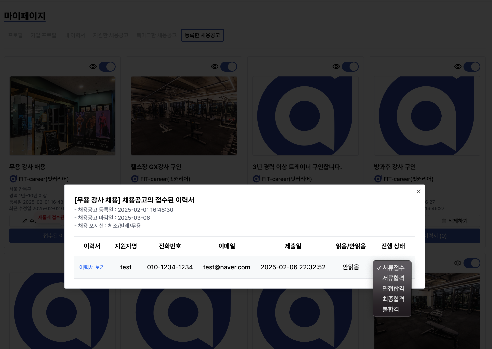

# FIT-career (핏커리어)

  
  
피트니스의 모든 정보, FIT Career

  
취업, 이직, 커리어 콘텐츠, 중고 거래, 대회 정보까지 피트니스 정보의 모든 것

## 🚀 프로젝트 소개

FIT-career는 피트니스 전용 채용 플랫폼을 기반으로 피트니스 업계의 흩어져 있는 채용공고, 대회정보, 중고거래, 운동정보, 영양정보, 시장 트렌드 등을 한 곳에 모아 정보를 제공하여 현재 업계의 불편함을 해소하고자 하는 서비스 입니다.

- 무분별한 도배글과 비교적 낮은 품질의 채용정보를 전달하는 문제를 해결하는 데 집중합니다. 피트니스 기업은 채용 정보를 쉽게 등록 및 관리할 수 있고 구직자는 쉽게 채용 정보를 찾을 수 있도록 도와주는 플랫폼입니다.
- 양질의 정보를 한곳에 모아 커뮤니티를 형성하고 피트니스 관련 콘텐츠를 제공하여 커리어 성장에 도움을 주는 플랫폼입니다.
- 형성된 커뮤니티를 기반으로 중고 거래 정보를 한곳에서 쉽고 편리하고 관리할 수 있는 플랫폼입니다.
- 흩어져 있는 대회 일정 및 정보를 한눈에 볼 수 있도록 정보를 제공하는 플랫폼입니다.

### 핵심 기능

- 🎯 채용 공고 등록 및 관리
- 👥 이력서 등록 및 관리
- 💼 커뮤니티 형성을 통한 양질의 피트니스 콘텐츠 제공 (예정)
- 👫 중고 거래 정보 등록 및 관리 (예정)
- 🥇 대회 일정 및 정보 제공 (예정)
- 📊 실시간 시장 트렌드 분석 (예정)

## 🛠 기술 스택

### Frontend

- TypeScript
- Next.js 15
- React Query
- Zustand
- Tailwind CSS

### Backend

- Supabase

### Deploy

- Vercel

## 📱 주요 화면

#### 메인 페이지

#### 채용 정보

#### 채용공고 관리

    

#### 이력서 관리

  

#### 프로필 관리

 

#### 북마크 관리

 

## ✉️ 문의

- Email: psw0962@naver.com
- Web: https://fitcareer.co.kr

---

  
© 2025 FIT-career. All rights reserved.

